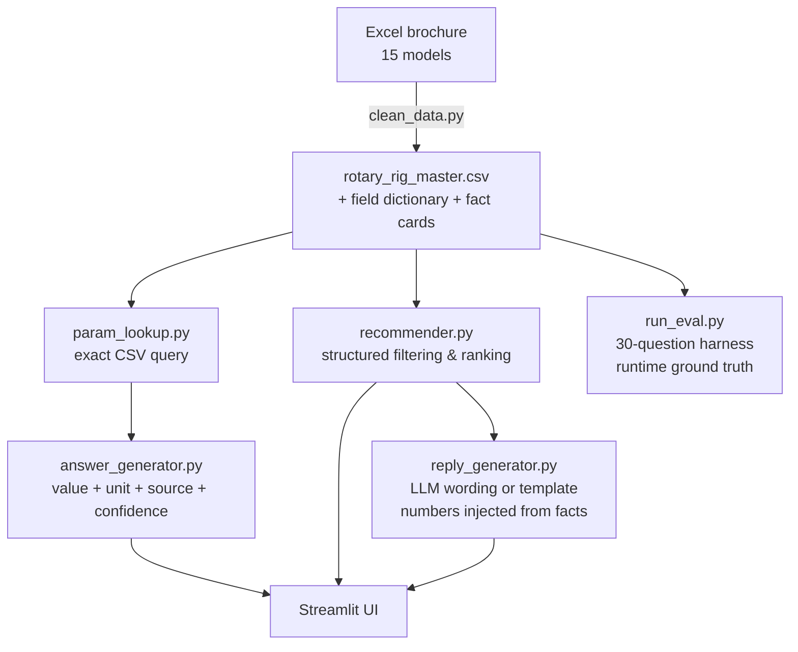

# Zoomlion Rotary Drilling Rig AI Sales Assistant

An AI sales assistant for rotary drilling rig sales teams in the Middle East market — built as an AI Product Manager portfolio project in a 7-day sprint.

**The core thesis: in industrial equipment sales, parameter hallucination is a deal-breaking risk, so parameters must come from structured data — never from LLM generation.**

## 1. Problem

Sales teams need to answer customer questions, compare models, and send professional English/Arabic replies within minutes, but product data is scattered across Excel, PDF and brochures. Naive "dump PDFs into a vector DB" RAG produces confident wrong numbers — reproduced during this project: a max drilling depth of 56/70 m was hallucinated as "78/100 m" when retrieval silently failed, and a 2000 mm diameter drifted to "2200 mm" inside a long LLM answer.

## 2. Solution

A high-reliability assistant with a hard separation of concerns:

| Path | Engine | LLM involved? |
|---|---|---|
| Parameter lookup / comparison | Exact CSV query | No |
| Model recommendation | Structured filtering + deterministic ranking | No |
| Customer reply wording | DeepSeek (numbers injected from structured facts) | Yes, wording only — with deterministic template fallback |
| Missing data (price, fuel, N/A) | Explicit refusal | No |

## 3. Key Features

- Free-text parameter lookup in English and Chinese ("ZR255R 钻深" works), plus dropdown access
- Combined-value fidelity: `56/70 m` is shown as-is and explained as Interlock / Friction Kelly configurations
- Requirement-based recommendation (depth/diameter) with required-Kelly-configuration flag and "sales reference only" disclaimer
- English/Arabic customer reply generation; every number is injected from structured facts
- Full source attribution on every answer (file / sheet / data version)
- Refusal on missing data: N/A stays N/A, price/fuel/delivery questions are declined
- Observable degradation: if the LLM call fails, the UI says why (e.g. HTTP 402) and falls back to templates

## 4. Evaluation (the part most demos skip)

A repeatable 30-question evaluation harness (`src/run_eval.py`) with anti-gaming design: ground truth is read from the master CSV at runtime (never hardcoded in the scorer), trap questions require programmatic proof, and any exception scores as FAIL.

| Metric | Result | Target |
|---|---:|---:|
| Parameter accuracy | 100% (15/15) | ≥90% |
| Unit accuracy | 100% (15/15) | 100% |
| Refusal correctness | 100% (5/5) | ≥80% |
| Source attribution | 100% (15/15) | 100% |
| Recommendation correctness | 100% (5/5) | ≥80% |
| Reply quality gate | 100% (5/5) | 100% |

Run it yourself: `python src/run_eval.py` (exit code 0 = all targets met).

## 5. Tech Stack

- **Dify Cloud** — Day-2 low-code RAG prototype (15 model fact cards, hybrid retrieval, citations)
- **Python + Streamlit + pandas** — the structured main version (this repo)
- **DeepSeek API** — optional, reply wording only (`.env` with `DEEPSEEK_API_KEY`)
- **CSV as source of truth** — cleaned from the official Excel brochure with a reproducible script

## 6. Architecture



See [docs/architecture.md](docs/architecture.md) for design decisions, and [docs/PRD.md](docs/PRD.md) for the product spec.

## 7. Quick Start

```bash
pip install -r requirements.txt          # streamlit, pandas
python src/test_lookup.py                # unit tests
python src/test_recommender.py
python src/run_eval.py                   # 30-question evaluation
streamlit run app.py                     # launch the app
```

> Windows ARM64 note: install x64 Python 3.12 and create the venv with it (pyarrow has no ARM64 wheels).

Optional LLM replies: create `.env` in the project root with `DEEPSEEK_API_KEY=...` — without it, replies use a safe deterministic template.

## 8. Demo Scenarios

1. `What is the max drilling depth of ZR255R?` → 56/70 m, Kelly explanation, source, High confidence
2. `ZR600GW的最大输出扭矩是多少？` → 600 kN·m (Chinese queries work)
3. Recommend for 60 m / 2000 mm → ZR300D first (key model, Interlock-capable, smallest adequate margin)
4. `What is the price of ZR255R?` → refused, no invented numbers
5. `What is the swing radius of ZR380D?` → "recorded as N/A", not a made-up value

## 9. Project Documents

| Doc | Content |
|---|---|
| [PRD.md](docs/PRD.md) | Product spec: users, pain points, scope, metrics, roadmap |
| [architecture.md](docs/architecture.md) | Architecture & design decisions |
| [data_cleaning_report.md](docs/data_cleaning_report.md) | Data quality findings (combined values, N/A, unit traps) |
| [eval_report_day5.md](docs/eval_report_day5.md) | Auto-generated evaluation report |
| [test_log_day2.md](docs/test_log_day2.md) … day4 | Daily test logs incl. the hallucination cases that shaped the design |

## 10. Roadmap

- PDF/Word marketing-material layer (explanation only, never a parameter source)
- LLM-output number verification (post-check every digit against structured facts)
- More product categories (hydraulic grab, trench cutter) reusing the cleaning pipeline
- Inquiry history & CRM integration; Arabic UI
